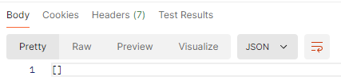

## Backend
1. Выполняем настройку .env
2.  Скачиваем зависимости

        composer install
3.  Создаем базу данных

        CREATE USER "api-users" WITH PASSWORD '12345';
        CREATE DATABASE "api-users" WITH OWNER 'api-users';
4.  Запускаем миграции базы данных:

        php artisan migrate
5.  Запускаем сидеры:

        php artisan db:seed

6.  Генерируем ключ приложения:

        php artisan key:generate

7.  Запускаем сервер

        php artisan serve
8. Добавление юзера: METHOD: POST; URL:http://127.0.0.1:8000/api/sign-up

     request:
      ```json 
   {
   "name": "Admin admin",
   "email":"admin2@mail.ru",
   "password":"Cott2289!",
   "password_confirmation":"Cott2289!"
   }
   ``` 
   response:
   ```json 
    {
    "user": {
        "id": 5,
        "email": "admin2@mail.ru",
        "name": "Admin admin"
    } 

9. Авторизация:METHOD: POST; URL: http://127.0.0.1:8000/api/sign-in
   
   request:
   ```json 
   {
   "email":"admin2@mail.ru",
   "password":"Cott2289!"
   }
   ```
   response:
   ```json
    {
    "token": "4|4OMXzkaii9dKfd1bTp8sPLuv4gl5JwspLu0XnOH43963cdfd"
    }
   ```
   
10.Перед пунктами 11-14 не обходимо ввести *Bearer-token*, полученный при авторизации
и поставить в 
```Headers Accept: application/json```

11. Обновление информации о пользователе
    METHOD: POST; URL: http://127.0.0.1:8000/api/user/
    
    request:
```json 
   {
  "email":"admin2@mail.ru",
  "old_password":"Cott2289!",
  "password":"Cott2290!",
  "password_confirmation":"Cott2290!",
  "name":"Admin Adminov"
   }
   ```
response:
```json
{
    "user": {
        "id": 5,
        "email": "admin2@mail.ru",
        "name": "Admin Adminov"
    }
}
```
 
12. Получение информации о пользователе
METHOD: GET; URL: http://127.0.0.1:8000/api/user/
    
response:
   ```json
   {
    "user": {
        "id": 5,
        "email": "admin2@mail.ru",
        "name": "Admin Adminov"
    }
}
   ```
 
13. Удаление пользователя:
METHOD: DELETE; URL: http://127.0.0.1:8000/api/user/
    
    response:

```json
{
    "status": "success"
}
```

14. Выход: METHOD: DELETE; URL:http://127.0.0.1:8000/api/sign-out/
    
    response:
    
    


